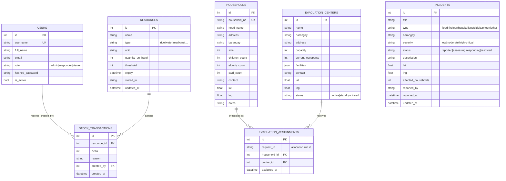

# Data Model / ERD

Entity diagrams and field reference for `backend/app/models/*`. Tables are created by the models (dev) or by Alembic migrations (production) — see `docs/DEPLOYMENT.md`.

---

## Entity-Relationship diagram

---

## Relationships

| From | To | Cardinality | Notes |
| --- | --- | --- | --- |
| `resources` | `stock_transactions` | 1 → N | each adjustment minus/plus logs a row |
| `users` | `stock_transactions` | 1 → N | `created_by` nullable (system adjustments) |
| `households` | `evacuation_assignments` | 1 → N | one household per assignment row per run |
| `evacuation_centers` | `evacuation_assignments` | 1 → N | `center_id` nullable (overflow households) |

---

## Business rules

- **Roles** — ranking `viewer(1) < responder(2) < admin(3)`; an endpoint grants access when the caller's rank ≥ the least-privileged allowed role.
- **Incident workflow** — status must follow `reported → assessing → responding → resolved` (backwards to `assessing` allowed). Any PATCH to `/incidents/{id}` with a `status` jump is rejected with 400.
- **Stock adjustments** — quantity_on_hand can never drop below zero (400 otherwise); every delta is recorded in `stock_transactions`.
- **Center status** — allocation only considers centers with status `active` or `standby`.
- **Coverage gaps** — allocation reports barangays that have households but no evacuation center.
- **Simulator evacuee baseline** — `affected_households × 4 persons` (configurable via `AVG_PERSONS_PER_HOUSEHOLD`), consumption rates per resource type live in `app/services/common.py`.

---

## Model locations

- `backend/app/models/user.py` — User
- `backend/app/models/household.py` — Household
- `backend/app/models/center.py` — EvacuationCenter
- `backend/app/models/resource.py` — Resource, StockTransaction
- `backend/app/models/incident.py` — Incident
- `backend/app/models/evacuation.py` — EvacuationAssignment
- `backend/app/models/__init__.py` — imports all models onto the shared `Base`